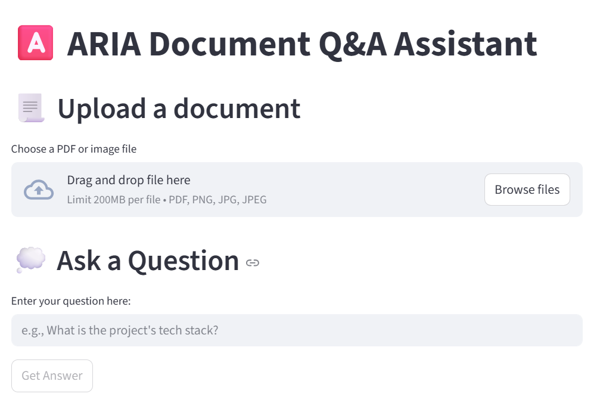

# AI Retrieval & Intelligent Analysis
![GPT-4.1]
![PaddleOCR]
![FAISS]
![Pinecone]
![FastAPI]
![Streamlit]
![Docker]


## 🚀 Project Overview

ARIA (AI Retrieval & Intelligent Analysis) is a document Q&A assistant that allows you to upload PDF and image documents and ask questions about their content using natural language. The system uses OCR, a vector database, and an LLM to provide accurate, context-aware answers with source citations.

This project is built to demonstrate a complete RAG (Retrieval-Augmented Generation) pipeline, from document ingestion to answer generation.


## ⚙️ Tech Stack
The core technologies used in this project are:

- **OCR:** PaddleOCR

- **Backend:** Python with FastAPI and Streamlit

- **Vector Store:** Pinecone (free-tier)

- **Embeddings:** OpenAI text-embedding-3-small

- **LLM:** OpenAI GPT-4.1-nano

- **Containerization:** Docker


## 🗺️ Project Structure
```
aria-qa-assistant/
├── src/
|   | 
│   ├── ocr/             # OCR processing
│   │   └── processor.py
│   ├── embeddings/      # text chunking & embeddings
│   │   └── vector_store.py
│   │    
│   ├── retrieval/       #  RAG Pipeline
|   |   └──  rag_pipeline.py
│   ├── api/             # FastAPI endpoints
│   |   └── main.py
│   | 
|   ├── frontend/
|   |    └── app.py
├── docs/                # test documents
├── docker/              # containerization assets
├── tests/               # unit tests
└── requirements.txt     # Python dependencies
└── README.md
```

## 🛠️ Setup and Installation
Prerequisites
- Python 3.9 (this version helps avoid conflicts with PaddleOCR)
- Docker (for containerized deployment)

**Local Setup**

1. Clone the repository
```
git clone https://github.com/DeepAxion/aria-qa-assistant.git
cd aria-qa-assistant
```

2. Set up the virtual environment
```
python -m venv venv
venv/scripts/activate 
```

3. Install dependencies
```
pip install -r requirements.txt
```

4. Configure API Keys
Create a .env file in the project root to store your OpenAI API key and Pinecone API key

```
OPENAI_API_KEY="your_api_key_here"
PINECONE_API_KEY="your_api_key_here"
```

5. Run the application
You can run the Streamlit frontend.
```
streamlit run src/frontend/app.py
```


### 🎦 Demo
<p align="center">
  
</p>


[GPT-4.1]:https://img.shields.io/badge/Model-GPT--4.1-412991?logo=openai&logoColor=white
[PaddleOCR]: https://img.shields.io/badge/OCR-PaddleOCR-1C5D99?logo=paddlepaddle&logoColor=white
[FastAPI]: https://img.shields.io/badge/API-FastAPI-009688?logo=fastapi&logoColor=white
[Streamlit]: https://img.shields.io/badge/App-Streamlit-FF4B4B?logo=streamlit&logoColor=white
[Docker]: https://img.shields.io/badge/Container-Docker-2496ED?logo=docker&logoColor=white
[FAISS]: https://img.shields.io/badge/Similarity%20Search-FAISS-blue?logo=meta&logoColor=white
[Pinecone]: https://img.shields.io/badge/Vector%20DB-Pinecone-0EAD69?logo=pinecone&logoColor=white
[Docker]: https://img.shields.io/badge/Container-Docker-2496ED?logo=docker&logoColor=white
